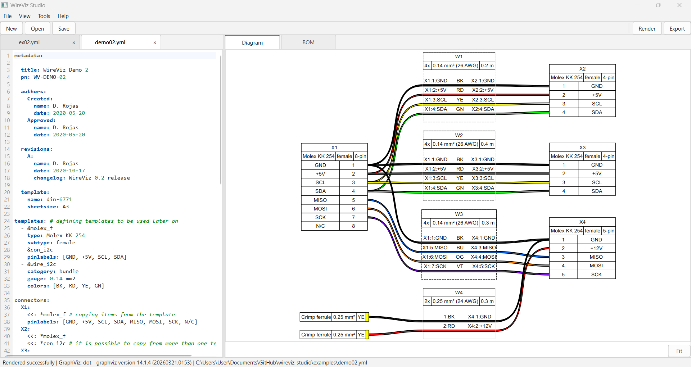

# WireViz Studio

WireViz Studio is a desktop application for creating wiring harness diagrams and BOMs from YAML input.

It combines:

- A multi-tab YAML editor
- Manual render flow for fast, predictable iteration
- Diagram preview and BOM view
- Export to SVG, PNG, PDF, and CSV

## Interface Preview



## Status

Current status for this repository is tracked in:

- docs/implementation-progress.md

## Key Features

- YAML-first workflow suitable for version control
- Cross-platform GUI built with PySide6
- Built-in GraphViz detection with bundled fallback support
- Automatic BOM generation from connector and cable definitions
- Export worker pipeline with non-blocking UI execution
- Light and dark theme support

## Installation

### End Users

Download packaged builds from GitHub Releases:

- https://github.com/ayieko168/WireViz-GUI/releases

Portable archives are named with explicit metadata:

- wireviz-studio-<version>-portable-<platform>-<python-tag>.<ext>

Examples:

- wireviz-studio-1.2.0-portable-windows-py3.13.zip
- wireviz-studio-1.2.0-portable-macos-py3.13.tar.gz
- wireviz-studio-1.2.0-portable-linux-py3.13.tar.gz

### From Source

Requirements:

- Python 3.10+
- GraphViz available in PATH or bundled_graphviz location

Setup:

```powershell
./venv/Scripts/python.exe -m pip install --upgrade pip
./venv/Scripts/python.exe -m pip install ".[gui]"
```

Run the app:

```powershell
$env:PYTHONPATH = ".\src"
./venv/Scripts/python.exe -m wireviz_studio
```

## Quick Start

1. Open WireViz Studio.
2. Create a new YAML document.
3. Add connectors, cables, and connections.
4. Run Render.
5. Review diagram and BOM tabs.
6. Export to the required output format.

Minimal YAML example:

```yaml
connectors:
  X1:
    pincount: 2
  X2:
    pincount: 2

cables:
  W1:
    wirecount: 2
    length: 1

connections:
  - [X1, W1, X2]
```

## Documentation Map

- Syntax reference: syntax.md
- Tutorial walkthrough: ../tutorial/readme.md
- Advanced image usage: advanced_image_usage.md
- Contributor guide: CONTRIBUTING.md
- Changelog: CHANGELOG.md

## Development and Packaging

Core tests:

```powershell
./venv/Scripts/python.exe -m pytest tests/core -q
```

Portable build:

```powershell
./venv/Scripts/python.exe packaging/build_portable.py --build-type portable --clean
```

Cleanup generated outputs:

```powershell
./venv/Scripts/python.exe packaging/clean_build_outputs.py --include-caches
```

## License

GPL-3.0-only
